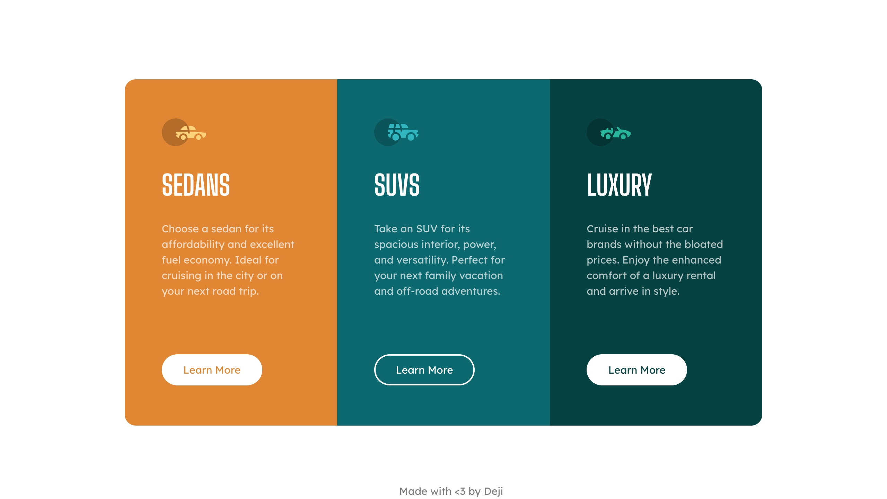

# Frontend Mentor - 3-column preview card component solution

This is a solution to the [3-column preview card component challenge on Frontend Mentor](https://www.frontendmentor.io/challenges/3column-preview-card-component-pH92eAR2-). Frontend Mentor challenges help you improve your coding skills by building realistic projects.

## Table of contents

- [Overview](#overview)
  - [The challenge](#the-challenge)
  - [Screenshot](#screenshot)
  - [Links](#links)
- [My process](#my-process)
  - [Built with](#built-with)
- [Author](#author)

## Overview

### The challenge

Users should be able to:

- View the optimal layout depending on their device's screen size
- See hover states for interactive elements

### Screenshot

### Links

- [Solution URL](https://github.com/deji-dd/three-column-component)
- [Live Site URL](https://35k444-3000.preview.csb.app/)

## My process

### Built with

- [VS Code](https://code.visualstudio.com/) - Code Editor
- [Bootstrap](https://getbootstrap.com/) - Style Library
- [React](https://reactjs.org/) - JS library

## Author

- Frontend Mentor - [@deji-dd](https://www.frontendmentor.io/profile/deji-dd)
- Twitter - [@deji\_\_dd](https://twitter.com/deji__dd)
- LinkedIn - [Ayodeji Buraimoh](https://www.linkedin.com/in/ayodeji-buraimoh-1368b9243/)
